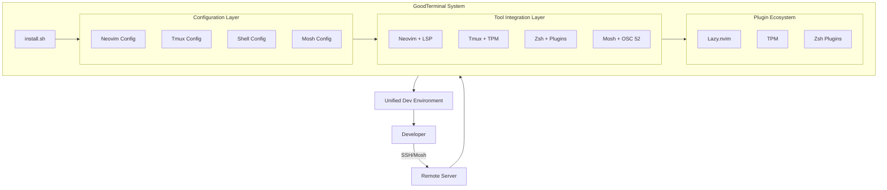
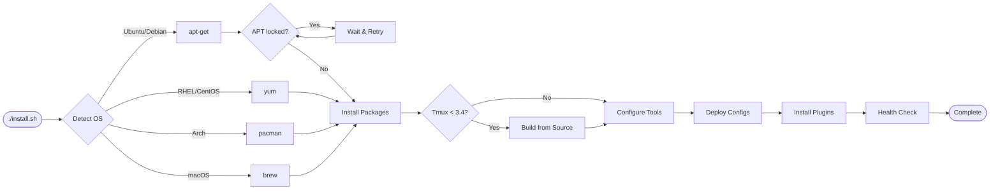
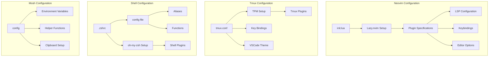
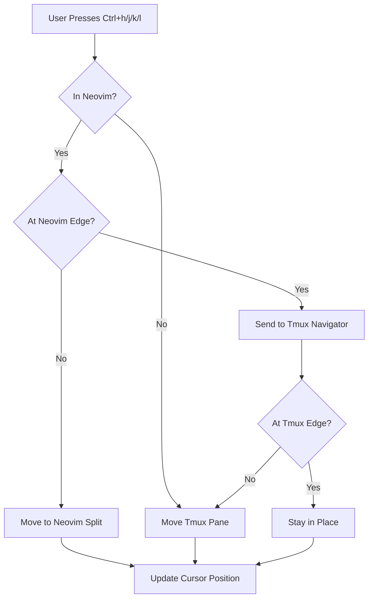
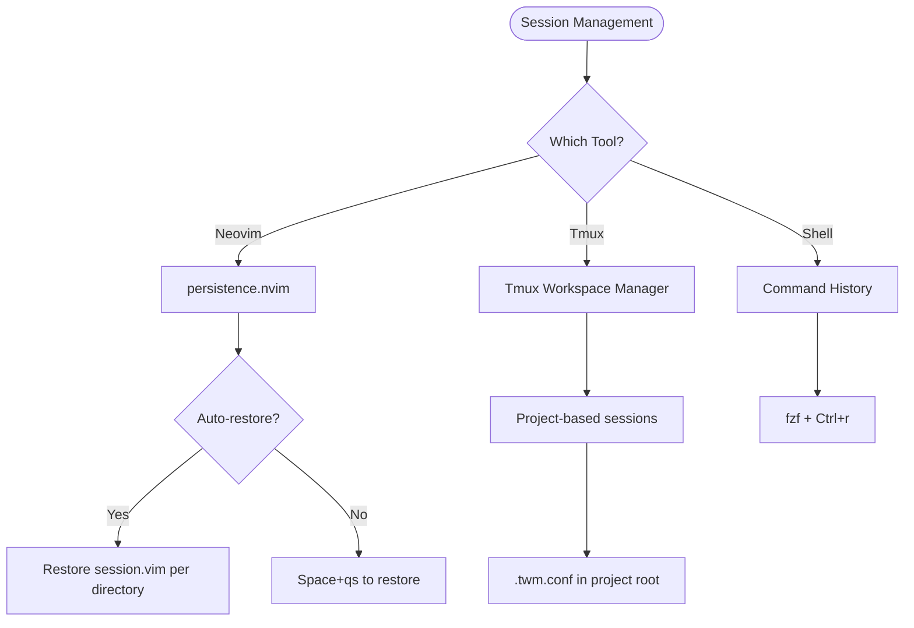
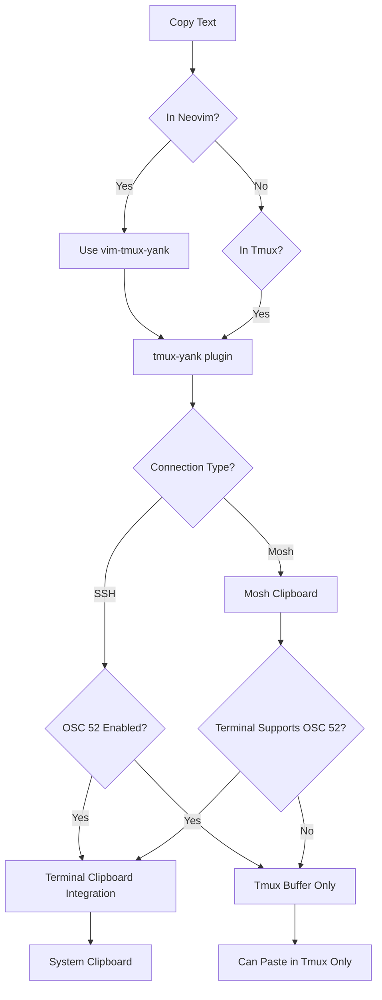
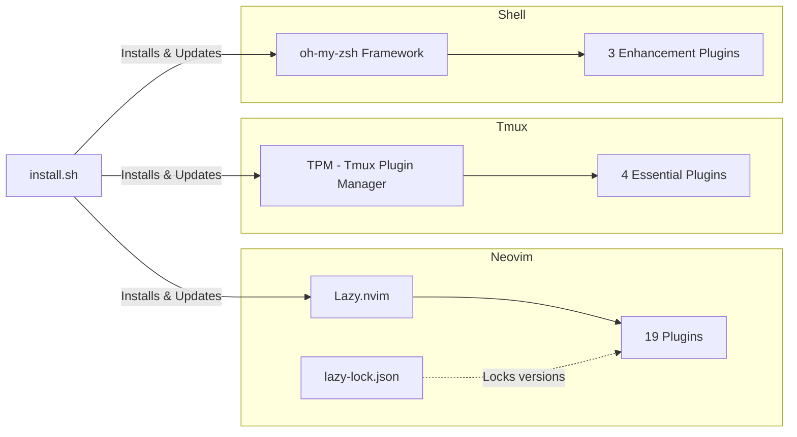
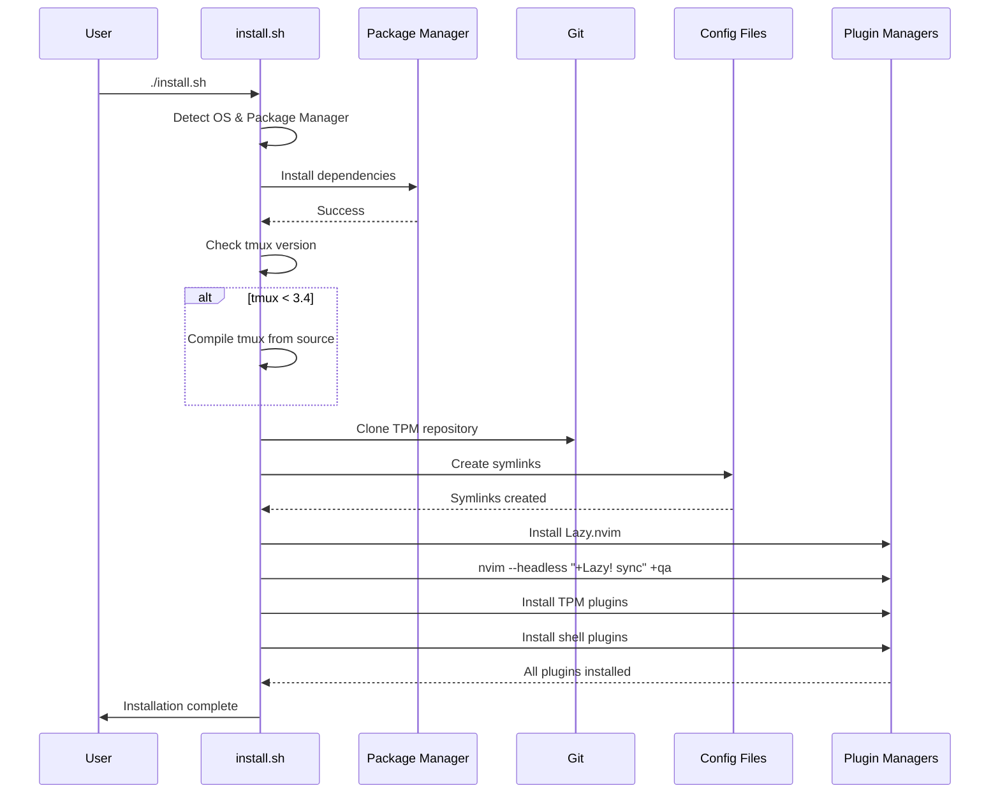
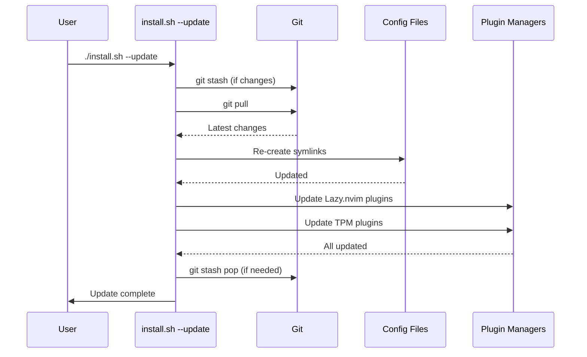
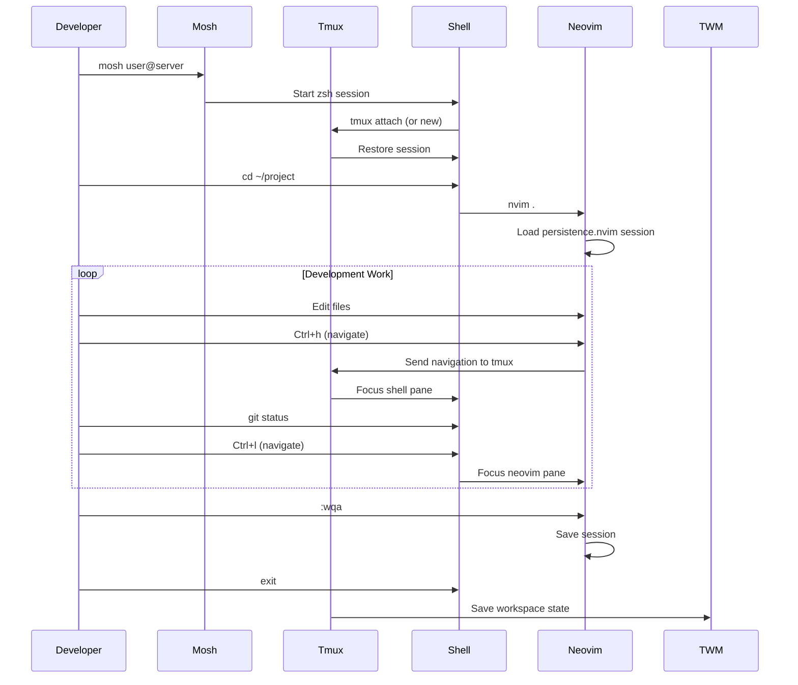

# GoodTerminal Architecture

This document describes the system architecture, component interactions, and key technical decisions for GoodTerminal.

## System Overview

GoodTerminal is a **configuration management system** for remote development environments. It orchestrates multiple tools (neovim, tmux, shell, mosh) into a unified, seamless development experience.



## Core Components

### 1. Installation System (install.sh)

The installation system is the entry point and orchestrator for all setup operations.

**File**: `install.sh` (1,308 lines)

**Responsibilities**:
- OS and package manager detection
- Dependency installation
- Tool compilation (tmux from source)
- Configuration deployment
- Plugin installation
- Health checking



**Key Technical Decisions**:
- **Compile tmux from source on Debian**: Ensures v3.4+ features available
- **APT lock handling**: Waits up to 5 minutes for locks to release (handles unattended-upgrades)
- **Symlinks for configs**: Allows live updates without manual sync
- **Headless plugin installation**: Uses `nvim --headless` to bypass interactive prompts

### 2. Configuration Layer

Each tool has its own configuration that follows tool-specific conventions while maintaining consistency.



**Configuration Files**:
- `config/nvim/init.lua` - Single-file neovim config (monolithic by design)
- `config/nvim/lazy-lock.json` - Locked plugin versions for reproducibility
- `config/tmux/tmux.conf` - Core tmux settings
- `config/tmux/vscode-theme.conf` - Theme with system monitoring
- `config/shell/config` - Shared aliases and functions
- `config/shell/zshrc.template` - Template for new installations
- `config/mosh/config` - Mosh-specific settings

### 3. Navigation Integration

The killer feature: seamless navigation across tmux panes and neovim splits with identical keybindings.



**Implementation**:
1. **vim-tmux-navigator** plugin in both neovim and tmux
2. **Neovim config** (`config/nvim/init.lua`):
   ```lua
   {
     'christoomey/vim-tmux-navigator',
     lazy = false,
     cmd = {
       "TmuxNavigateLeft",
       "TmuxNavigateDown",
       "TmuxNavigateUp",
       "TmuxNavigateRight",
     },
   }
   ```
3. **Tmux config** (`config/tmux/tmux.conf`):
   ```bash
   is_vim="ps -o state= -o comm= -t '#{pane_tty}' | grep -iqE '^[^TXZ ]+ +(\\S+\\/)?g?(view|n?vim?x?)(diff)?$'"
   bind-key -n 'C-h' if-shell "$is_vim" 'send-keys C-h' 'select-pane -L'
   # ... similar for j, k, l
   ```

**Result**: Muscle memory works everywhere. No mental context switch between tools.

### 4. Session Persistence

Multiple strategies for session management depending on tool:



**Key Decisions**:
- **Removed tmux-resurrect/continuum**: Too heavyweight, conflicts with TWM
- **persistence.nvim**: Lightweight, per-directory sessions
- **TWM for tmux**: Project-aware session management

### 5. Clipboard Handling

Complex due to remote nature and mosh constraints:



**Current Status** (from pending changes):
- OSC 52 **disabled** in working copy (troubleshooting Mosh issues)
- Using tmux buffer as primary clipboard mechanism
- Investigating terminal compatibility issues

**Known Issues**:
- Mosh doesn't support OSC 52 clipboard sequences consistently
- Some terminals (iTerm2, Alacritty) require specific settings
- Clipboard sync over SSH works better than over Mosh

### 6. Plugin Management

Each tool uses its own plugin manager:



**Neovim Plugins** (19 total):
1. **Navigation**: vim-tmux-navigator, nvim-tree
2. **LSP**: mason, mason-lspconfig, nvim-lspconfig
3. **Completion**: nvim-cmp, cmp-nvim-lsp, cmp-buffer, cmp-path, LuaSnip, cmp_luasnip
4. **Fuzzy Finding**: telescope, plenary
5. **Syntax**: nvim-treesitter
6. **Git**: gitsigns, lazygit.nvim
7. **UI**: lualine, bufferline, vscode.nvim (theme)
8. **Utilities**: Comment.nvim, nvim-autopairs, persistence.nvim
9. **AI**: Windsurf (by Codeium)

**Tmux Plugins** (4 essential):
1. tpm - Plugin manager
2. tmux-sensible - Sane defaults
3. vim-tmux-navigator - Seamless navigation
4. tmux-yank - Clipboard integration

**Shell Plugins** (3 enhancements):
1. zsh-autosuggestions - Fish-like suggestions
2. zsh-syntax-highlighting - Real-time syntax validation
3. zsh-autocomplete - Advanced completion

## Data Flow

### Installation Flow



### Update Flow



### Typical Development Session



## Key Technical Decisions

### 1. Single-File Neovim Config

**Decision**: Use one `init.lua` file instead of modular structure.

**Rationale**:
- Lazy.nvim supports single-file configs well
- Easier to understand for new users
- Simpler to maintain and update
- All plugin specs in one place
- Currently 400 lines - manageable size

**Trade-offs**:
- ✅ Simplicity
- ✅ Easy to navigate
- ❌ Can become large (mitigated by Lazy's organization)

### 2. Compile Tmux from Source (Debian)

**Decision**: Build tmux 3.4 from source on Debian/Ubuntu systems.

**Rationale**:
- Debian stable ships tmux 3.0-3.2
- Features needed: OSC 52 improvements, better clipboard, popup support
- Backports often lag behind

**Implementation** (`install.sh:490-530`):
```bash
if [ "$tmux_version" -lt 304 ]; then
    echo "Installing tmux from source..."
    # Download, compile, install
fi
```

### 3. Symlinks vs. Copies for Configs

**Decision**: Use symlinks to goodterminal repo for all configs.

**Rationale**:
- Live updates: `git pull` immediately affects all tools
- Single source of truth
- Easy rollback: `git checkout` previous version
- Version control benefits

**Implementation**:
```bash
ln -sf "$GOODTERMINAL_DIR/config/nvim/init.lua" ~/.config/nvim/init.lua
ln -sf "$GOODTERMINAL_DIR/config/tmux/tmux.conf" ~/.tmux.conf
```

**Trade-off**: Requires goodterminal directory to stay in place.

### 4. Lazy.nvim Over Other Plugin Managers

**Decision**: Use Lazy.nvim instead of Packer, vim-plug, or others.

**Rationale**:
- Modern, actively maintained (2023+)
- Lazy loading by default (faster startup)
- Lock file for reproducibility (`lazy-lock.json`)
- Great UI for plugin management
- Single-file config support

### 5. No tmux-resurrect/continuum

**Decision**: Removed tmux-resurrect and tmux-continuum plugins.

**Rationale** (from recent commits):
- Conflicts with TWM (Tmux Workspace Manager)
- persistence.nvim handles neovim sessions better
- Simpler mental model: one tool per job
- Reduces plugin complexity

**Current State**: Using TWM + persistence.nvim instead.

### 6. OSC 52 Clipboard (Currently Disabled)

**Decision**: Temporarily disabled OSC 52 sequences.

**Rationale**:
- Mosh doesn't consistently support OSC 52
- Terminal compatibility varies (iTerm2 yes, some others no)
- Causes issues with copy/paste in certain scenarios
- Using tmux buffer as fallback

**Status**: Under investigation (see troubleshooting/clipboard.md).

### 7. Minimal Shell Framework

**Decision**: Use oh-my-zsh but with minimal plugins.

**Rationale**:
- oh-my-zsh provides solid foundation
- Only load essential plugins (3 total)
- Faster startup than full oh-my-zsh installations
- Balance between features and performance

**Not Using**: Frameworks like Prezto, zim, or antibody (oh-my-zsh is ubiquitous).

### 8. TWM for Project Management

**Decision**: Integrate TWM (Tmux Workspace Manager) for project-based sessions.

**Rationale**:
- Developers work on multiple projects
- Each project needs its own layout
- `.twm.conf` files in project roots define layouts
- Complements tmux sessions nicely

**Implementation**: Compiled from Rust source, bound to prefix+P.

## Security Considerations

### Input Validation
- User paths are quoted to prevent injection
- No `eval` of user input
- Package manager commands use fixed arguments

### Backup Strategy
- All existing configs backed up before modification
- Backups timestamped: `~/.config/nvim/init.lua.backup-YYYYMMDDHHMMSS`
- Git repository changes stashed before updates

### Network Safety
- All downloads over HTTPS
- TPM cloned from official GitHub
- Lazy.nvim plugins from curated list
- No arbitrary code execution from configs

### Privilege Requirements
- **Does NOT require root** for most operations
- Only uses sudo for:
  - Package installation
  - Tmux compilation (install to /usr/local)
- User configs in home directory only

## Performance Characteristics

### Installation Time
- **Full Install**: 5-10 minutes (varies by network and CPU for tmux compilation)
- **Config Update**: 30-60 seconds
- **Plugin Update**: 1-2 minutes

### Startup Times
- **Zsh**: ~200ms (with plugins)
- **Tmux**: ~100ms
- **Neovim**: ~300ms (with lazy loading)

**Total time to productive**: < 1 second after `nvim` command.

### Resource Usage
- **Memory**: ~50MB for tmux + neovim + shell combined
- **Disk**: ~200MB including all plugins
- **CPU**: Negligible when idle

## Extension Points

### Adding New Plugins

**Neovim** (`config/nvim/init.lua`):
```lua
{
  'author/plugin-name',
  lazy = true,  -- optional lazy loading
  config = function()
    -- plugin configuration
  end,
}
```

**Tmux** (`config/tmux/tmux.conf`):
```bash
set -g @plugin 'author/plugin-name'
```

**Shell** (`config/shell/config`):
```bash
# Add to plugins array
plugins=(git zsh-autosuggestions new-plugin)
```

### Custom Keybindings

All keybindings centralized in respective config files:
- Neovim: `config/nvim/init.lua` (search for `vim.keymap.set`)
- Tmux: `config/tmux/tmux.conf` (search for `bind-key`)
- Shell: `config/shell/config` (search for `bindkey`)

### Per-User Customizations

Users can add:
- `~/.config/nvim/after/` directory for neovim overrides
- `~/.tmux.conf.local` for tmux additions
- `~/.zshrc.local` for shell additions

These are **not** overwritten by updates.

## Testing Strategy

### Manual Testing Checklist
- [ ] Full installation on fresh VM (per OS)
- [ ] Update from previous version
- [ ] Navigation works (Ctrl-hjkl)
- [ ] Clipboard works in SSH
- [ ] Clipboard works in Mosh
- [ ] LSP autocomplete works
- [ ] Session persistence works
- [ ] TWM project switching works
- [ ] All keybindings responsive

### Automated Testing
See `tests/` directory for integration tests (TODO: implement per high-priority action #4).

## Future Architecture Considerations

### Modularity
As install.sh grows beyond 1,500 lines, consider:
```
scripts/
├── lib/
│   ├── os-detection.sh
│   ├── package-manager.sh
│   ├── installers/
│   │   ├── tmux.sh
│   │   ├── neovim.sh
│   │   └── shell.sh
│   └── config-deployer.sh
└── install.sh (orchestrator)
```

### Remote Config Management
Potential future: pull configs from central server instead of git clone.

### Health Monitoring
Dashboard showing status across multiple servers.

### Declarative Profiles
YAML/JSON config to define tool versions and plugins instead of bash script.

## References

- [Lazy.nvim Documentation](https://github.com/folke/lazy.nvim)
- [TPM Documentation](https://github.com/tmux-plugins/tpm)
- [vim-tmux-navigator](https://github.com/christoomey/vim-tmux-navigator)
- [TWM (Tmux Workspace Manager)](https://github.com/vinnymeller/twm)
- [Mosh Documentation](https://mosh.org/)

---

**Last Updated**: 2025-12-19
**Architecture Version**: 1.0
