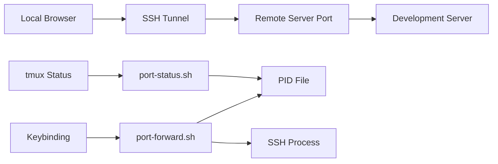

# GoodTerminal Port Forwarding

A VS Code Remote-SSH inspired port forwarding system for tmux sessions that automatically detects and forwards development server ports from remote machines to your local machine.

## Features

- **Auto-detection**: Automatically finds running development servers on common ports
- **One-command setup**: Single command to forward all detected development ports
- **tmux integration**: Shows active forwards in the status bar and provides keybindings
- **Visual feedback**: Status bar shows active port forwards and detected servers
- **Configuration**: Customizable port forwarding rules
- **SSH tunnel management**: Automatic SSH reverse tunnel creation and cleanup

## How It Works

When you're SSH'd into a remote server and working in tmux:

1. **Detection**: Scans common development ports (3000, 5173, 8080, etc.) for running services
2. **Tunneling**: Creates SSH reverse tunnels to forward those ports to your local machine
3. **Management**: Tracks active forwards and provides easy start/stop controls
4. **Display**: Shows status in tmux status bar with visual indicators

## Quick Start

### In tmux session on remote server:
```bash
# Auto-detect and forward all development servers
prefix + P

# Stop all port forwards
prefix + Ctrl+p
```

### Command line usage:
```bash
# Auto-forward detected servers
pf auto

# Show current status
pf status

# Add custom port forward
pf add 3000

# Stop all forwards
pf stop
```

## Status Bar Indicators

The tmux status bar shows:
- `⇄ 3000 8080` - Active port forwards on ports 3000 and 8080
- `⇄ 4 ports` - 4 or more active port forwards
- `3 dev` - 3 development servers detected but not forwarded
- `No forwards` - No active port forwards

## Configuration

Edit `~/.config/goodterminal/port-forwards.conf`:

```bash
# Format: LOCAL_PORT:REMOTE_HOST:REMOTE_PORT:DESCRIPTION
3000:localhost:3000:React Development Server
5173:localhost:5173:Vite Dev Server
8080:localhost:8080:API Server
```

## Keybindings

| Key | Action |
|-----|--------|
| `prefix + P` | Auto-detect and forward development ports |
| `prefix + Ctrl+p` | Stop all active port forwards |

## Command Reference

### Port Forward Script (`pf` command)

```bash
pf auto         # Auto-detect and forward development servers
pf start        # Same as auto
pf stop         # Stop all active port forwards
pf status       # Show status and detected servers
pf detect       # Just scan for running servers
pf add PORT     # Add custom port forward interactively
pf edit         # Edit configuration file
pf help         # Show help
```

### Examples

```bash
# Basic workflow
pf auto                    # Start forwarding
# Work on your app...
pf status                  # Check what's forwarded
pf stop                    # Clean up when done

# Custom port forwarding
pf add 4000               # Add port 4000
# Enter details interactively

# Configuration
pf edit                   # Edit config file
```

## How Port Detection Works

The system scans these common development ports:
- **3000, 3001** - React, Next.js default ports
- **4000** - Express.js common port
- **5000** - Flask, generic development servers
- **5173** - Vite development server
- **8000** - Django, Python development servers
- **8080** - Generic development server
- **8888** - Jupyter notebooks
- **9000** - Various development tools

## Troubleshooting

### Port forward not working?
1. Ensure you're in an SSH session (`$SSH_CLIENT` should be set)
2. Check if local port is already in use
3. Verify SSH connection allows reverse tunneling

### Server not detected?
1. Check if service is actually running: `netstat -ln | grep :3000`
2. Ensure service is listening on all interfaces (`0.0.0.0:3000`) not just localhost
3. Add custom port to configuration file

### Permission issues?
```bash
# Make scripts executable
chmod +x ~/.config/goodterminal/scripts/port-forward.sh
chmod +x ~/.config/tmux/port-status.sh
```

### Clean up stale forwards
```bash
# Kill any hanging SSH processes
pkill -f "ssh.*-R.*:"

# Remove PID file
rm ~/.config/goodterminal/port-forwards.pid
```

## Integration with Other Tools

### VS Code Remote-SSH
Works alongside VS Code Remote-SSH. GoodTerminal handles tmux session forwards while VS Code handles its own ports.

### Mosh
Fully compatible with mosh connections. Port forwards work the same way.

### Docker/Compose
Detects ports exposed by Docker containers running on standard development ports.

## Files and Locations

- **Main script**: `~/.config/goodterminal/scripts/port-forward.sh`
- **Status script**: `~/.config/tmux/port-status.sh`
- **Configuration**: `~/.config/goodterminal/port-forwards.conf`
- **PID tracking**: `~/.config/goodterminal/port-forwards.pid`
- **Logs**: `~/.config/goodterminal/port-forwards.log`

## Architecture



The system creates SSH reverse tunnels that forward traffic from your local machine to the remote development servers, allowing you to access remote localhost:3000 from your local browser at localhost:3000.