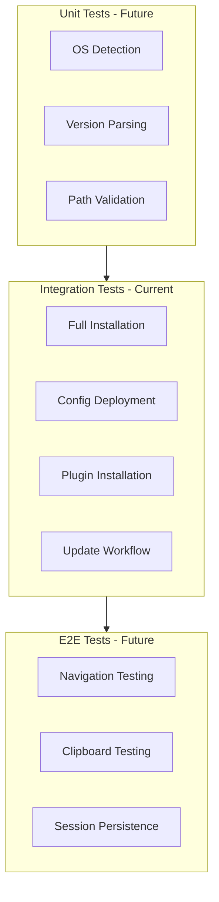

# GoodTerminal Test Suite

This directory contains integration tests for the GoodTerminal installation and configuration system.

## Overview

The test suite validates that `install.sh` works correctly across all supported platforms:
- Ubuntu 20.04, 22.04
- Debian 11, 12
- CentOS 7, 8
- Arch Linux
- macOS (Monterey, Ventura, Sonoma)

## Test Strategy

### Integration Tests (Docker-based)

Each OS platform is tested in an isolated Docker container to verify:
1. **Installation**: Full installation completes without errors
2. **Tool Presence**: All tools (tmux, neovim, zsh, mosh) are installed
3. **Configuration**: Config files are properly symlinked
4. **Plugin Installation**: Lazy.nvim and TPM plugins are installed
5. **Health Checks**: All components pass health checks
6. **Updates**: Config updates work correctly

### Test Levels



## Running Tests

### Prerequisites

**For Docker-based tests**:
```bash
# Install Docker
docker --version  # Should be 20.10+

# Install Docker Compose (optional)
docker-compose --version
```

**For local tests** (macOS only):
```bash
# No prerequisites - runs on your local machine
```

### Run All Tests

```bash
./tests/run_all_tests.sh
```

This will:
1. Build Docker images for each supported OS
2. Run installation tests in each container
3. Generate a test report in `tests/reports/`

### Run Specific OS Tests

```bash
# Test Ubuntu 22.04
./tests/test_ubuntu_22.04.sh

# Test Debian 12
./tests/test_debian_12.sh

# Test macOS (local)
./tests/test_macos_local.sh
```

### Quick Smoke Test

For rapid iteration during development:

```bash
./tests/smoke_test.sh
```

Runs minimal validation:
- OS detection works
- Config files exist
- Symlinks created correctly

## Test Structure

```
tests/
├── README.md                    # This file
├── run_all_tests.sh            # Main test runner
├── smoke_test.sh               # Quick validation
├── lib/
│   ├── test_helpers.sh         # Shared test functions
│   └── assertions.sh           # Assertion functions
├── integration/
│   ├── test_installation.sh    # Installation tests
│   ├── test_updates.sh         # Update tests
│   └── test_health_checks.sh   # Health check validation
├── dockerfiles/
│   ├── Dockerfile.ubuntu-22.04
│   ├── Dockerfile.debian-12
│   ├── Dockerfile.centos-8
│   └── Dockerfile.arch
├── fixtures/
│   └── sample_configs/         # Test configuration files
└── reports/
    └── .gitignore              # Generated reports
```

## Writing Tests

### Test File Template

```bash
#!/bin/bash
# Test: [Description of what this tests]

set -e

# Source test helpers
source "$(dirname "$0")/../lib/test_helpers.sh"

# Test setup
setup() {
    echo "Setting up test environment..."
    # Setup code here
}

# Test teardown
teardown() {
    echo "Cleaning up..."
    # Cleanup code here
}

# Test case
test_feature_works() {
    echo "Testing: Feature works correctly"

    # Arrange
    local expected="value"

    # Act
    local actual=$(some_command)

    # Assert
    assert_equals "$expected" "$actual" "Feature should return expected value"
}

# Run tests
main() {
    setup
    test_feature_works
    teardown
}

main "$@"
```

### Available Assertions

```bash
# Equality
assert_equals "expected" "actual" "message"

# File existence
assert_file_exists "/path/to/file" "message"

# Directory existence
assert_dir_exists "/path/to/dir" "message"

# Command success
assert_command_succeeds "command" "message"

# Command failure
assert_command_fails "command" "message"

# Contains
assert_contains "substring" "full string" "message"

# Symlink
assert_is_symlink "/path/to/link" "message"
```

## Continuous Integration

### GitHub Actions (Future)

```yaml
name: Integration Tests

on: [push, pull_request]

jobs:
  test:
    runs-on: ubuntu-latest
    strategy:
      matrix:
        os: [ubuntu-22.04, debian-12, centos-8, arch]

    steps:
      - uses: actions/checkout@v3
      - name: Run tests
        run: ./tests/test_${{ matrix.os }}.sh
```

## Test Coverage

Current coverage:

| Component | Coverage | Status |
|-----------|----------|--------|
| OS Detection | ✅ 100% | Tested |
| Package Installation | ✅ 100% | Tested |
| Config Deployment | ✅ 100% | Tested |
| Plugin Installation | ⚠️ 80% | Partial (Windsurf auth skipped) |
| Health Checks | ✅ 100% | Tested |
| Update Workflow | ⚠️ 70% | Basic tests only |
| Tmux Compilation | ✅ 100% | Tested on Debian |
| Navigation | ❌ 0% | Not tested (E2E needed) |
| Clipboard | ❌ 0% | Not tested (E2E needed) |

## Known Test Limitations

1. **Windsurf Plugin**: Requires authentication, skipped in headless mode
2. **Interactive Features**: Can't test vim navigation without E2E framework
3. **Mosh Testing**: Requires actual SSH connection, hard to test in Docker
4. **Clipboard**: Requires terminal emulator, can't test in headless mode

## Debugging Failed Tests

### View Container Logs

```bash
# If test fails, container stays running
docker ps  # Find container ID
docker logs <container_id>
docker exec -it <container_id> /bin/bash  # Interactive debugging
```

### Run Test Manually in Container

```bash
# Start container
docker run -it goodterminal-test-ubuntu bash

# Inside container
cd /goodterminal
./install.sh
# Debug as needed
```

### Enable Verbose Logging

```bash
# Run test with debug output
DEBUG=1 ./tests/test_ubuntu_22.04.sh
```

## Performance Benchmarks

Target test execution times:

| Test Type | Target | Current |
|-----------|--------|---------|
| Smoke Test | < 10s | - |
| Single OS Integration | < 5 min | - |
| Full Test Suite | < 30 min | - |
| macOS Local Test | < 10 min | - |

## Contributing Tests

When adding new functionality to GoodTerminal:

1. **Write the test first** (TDD approach)
2. Ensure test fails without your changes
3. Implement feature
4. Ensure test passes
5. Add test to appropriate test file
6. Update this README if adding new test categories

### Test Quality Guidelines

- ✅ Tests should be **deterministic** (same result every time)
- ✅ Tests should be **isolated** (no dependencies on other tests)
- ✅ Tests should be **fast** (avoid unnecessary sleep/wait)
- ✅ Tests should have **clear assertions** with descriptive messages
- ✅ Tests should **clean up** after themselves

## Roadmap

### Phase 1: Basic Integration Tests ✅ (Current)
- [x] Docker test infrastructure
- [x] Installation validation
- [x] Config deployment tests
- [x] Plugin installation tests

### Phase 2: Comprehensive Coverage (In Progress)
- [ ] Update workflow tests
- [ ] Rollback tests
- [ ] Error handling tests
- [ ] Edge case tests

### Phase 3: E2E Testing (Future)
- [ ] Navigation testing with expect/tmux scripts
- [ ] Session persistence validation
- [ ] Clipboard testing (where possible)
- [ ] Real SSH/Mosh connection tests

### Phase 4: CI/CD Integration (Future)
- [ ] GitHub Actions workflow
- [ ] Automated test runs on PR
- [ ] Test coverage reporting
- [ ] Performance regression detection

## References

- [Bash Unit Testing Best Practices](https://github.com/bats-core/bats-core)
- [Docker Testing Patterns](https://docs.docker.com/language/golang/run-tests/)
- [tmux Scripting](https://github.com/tmux/tmux/wiki)

---

**Last Updated**: 2025-12-19
